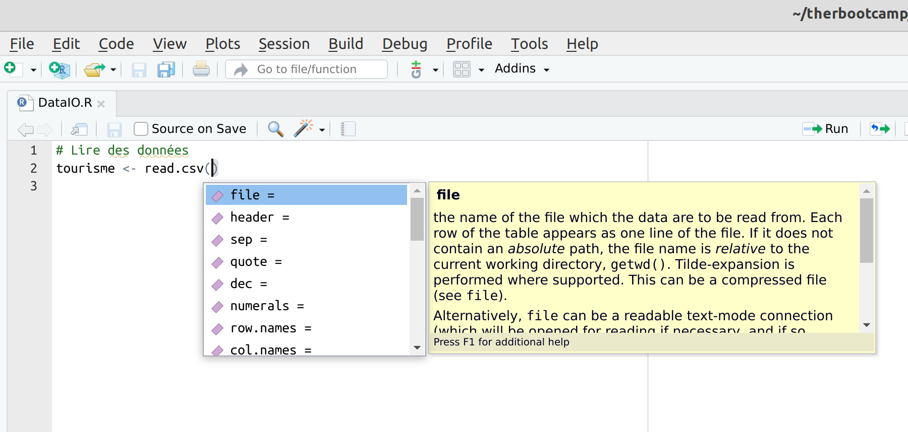
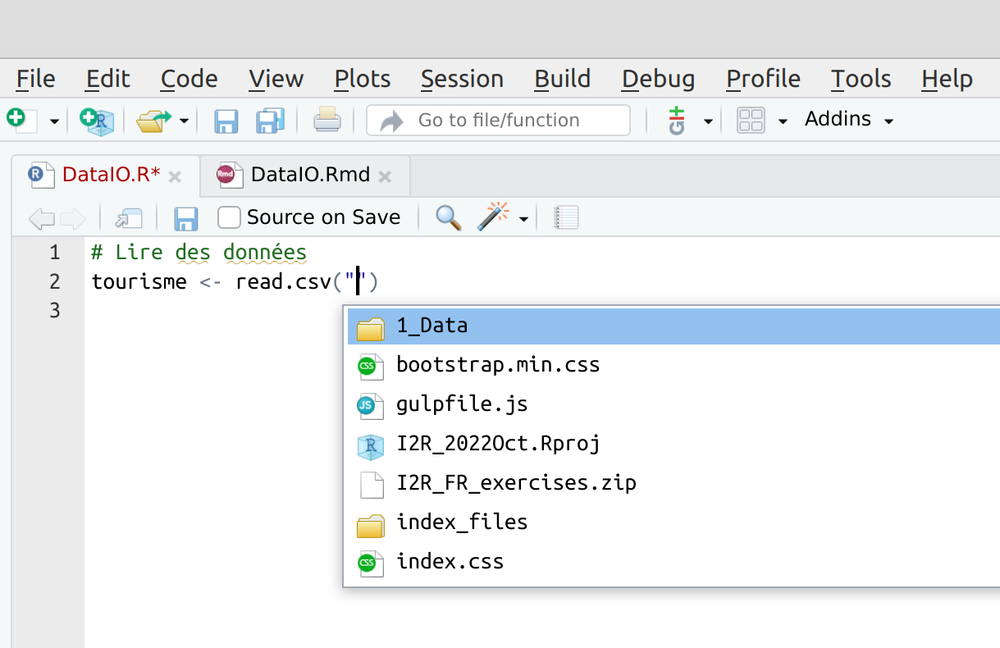
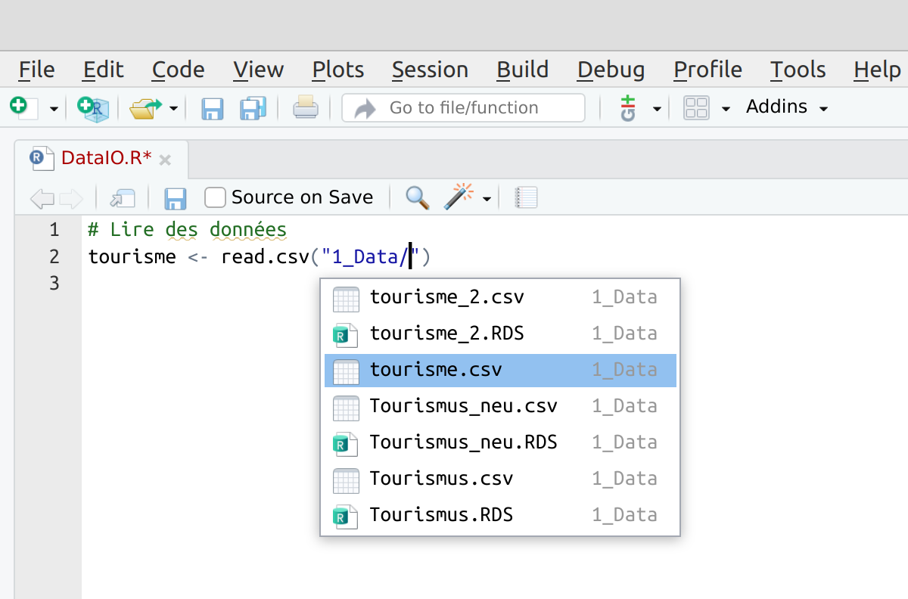

layout: true

<div class="my-footer">
  <span style="text-align:center">
    <span> 
      
    </span>
    <a href="https://therbootcamp.github.io/">
      <span style="padding-left:82px"> 
        <font color="#7E7E7E">
          www.therbootcamp.com
        </font>
      </span>
    </a>
    <a href="https://therbootcamp.github.io/">
      <font color="#7E7E7E">
      Introduction à l'analyse de données avec R | June 2023
      </font>
    </a>
    </span>
  </div> 

---

```{r setup, include=FALSE}
options(htmltools.dir.version = FALSE)
# see: https://github.com/yihui/xaringan
# install.packages("xaringan")
# see: 
# https://github.com/yihui/xaringan/wiki
# https://github.com/gnab/remark/wiki/Markdown
options(width=110)
options(digits = 4)

library(tidyverse)
```


# Agenda

.pull-left4[

<ul>
  <li class="m1g"><span>R(Studio)</span></li>
  <li class="m2g"><span>Assignations<br></span></li>
  <li class="m3g"><span>Fonctions</span></li>
  <li class="m4"><span><high>Données I/O</high></a></span></li>
  <ul class="level">
    <li><span>Charger des données</span></li>
    <li><span>Les données "vivent" dans les  <mono>data.frames</span></li>
    <li><span>3 + 1 types de données</span></li>
    <li><span>Enrégistrer des données dans des fichiers</span></li>
  </ul><br>
  <li class="m5g"><span>Analyse</span></li>
</ul>

]

.pull-right5[
<p align = "center">
<br>
<font style="font-size:10px">from <a href="https://xkcd.com//">xkcd.com</a></font>
</p>

]

---

# Charger des données

.pull-left4[

<ul>
  <li class="m1g"><span>R(Studio)</span></li>
  <li class="m2g"><span>Assignations<br></span></li>
  <li class="m3g"><span>Fonctions</span></li>
  <li class="m4"><span>Données I/O</a></span></li>
  <ul class="level">
    <li><span><high>Charger des données</high></span></li>
    <li><span>Les données "vivent" dans les  <mono>data.frames</span></li>
    <li><span>3 + 1 types de données</span></li>
    <li><span>Enrégistrer des données dans des fichiers</span></li>
  </ul><br>
  <li class="m5g"><span>Analyse</span></li>
</ul>

]

.pull-right5[

```{r, echo = F}
options(max.print=50)
```

```{r}
# Charger des données
read.csv('1_Data/tourisme.csv')
```
]

---

# Charger des données

.pull-left4[

<ul>
  <li class="m1g"><span>R(Studio)</span></li>
  <li class="m2g"><span>Assignations<br></span></li>
  <li class="m3g"><span>Fonctions</span></li>
  <li class="m4"><span>Données I/O</a></span></li>
  <ul class="level">
    <li><span><high>Charger des données</high></span></li>
    <li><span>Les données "vivent" dans les  <mono>data.frames</span></li>
    <li><span>3 + 1 types de données</span></li>
    <li><span>Enrégistrer des données dans des fichiers</span></li>
  </ul><br>
  <li class="m5g"><span>Analyse</span></li>
</ul>

]

.pull-right5[

```{r, echo = F}
options(max.print=50)
```

```{r}
# Charger des données et assigner à un objet
tourisme <- read.csv('1_Data/tourisme.csv')

# Voir les données
head(tourisme)

```
]


---

# Charger des données

.pull-left4[

<ul>
  <li class="m1g"><span>R(Studio)</span></li>
  <li class="m2g"><span>Assignations<br></span></li>
  <li class="m3g"><span>Fonctions</span></li>
  <li class="m4"><span>Données I/O</a></span></li>
  <ul class="level">
    <li><span><high>Charger des données</high></span></li>
    <li><span>Les données "vivent" dans les <mono>data.frames</span></li>
    <li><span>3 + 1 types de données</span></li>
    <li><span>Enrégistrer des données dans des fichiers</span></li>
  </ul><br>
  <li class="m5g"><span>Analyse</span></li>
</ul>

]

.pull-right5[
<p align = "center">

</p>

]

---

# Charger des données

.pull-left4[

<ul>
  <li class="m1g"><span>R(Studio)</span></li>
  <li class="m2g"><span>Assignations<br></span></li>
  <li class="m3g"><span>Fonctions</span></li>
  <li class="m4"><span>Données I/O</a></span></li>
  <ul class="level">
    <li><span><high>Charger des données</high></span></li>
    <li><span>Les données "vivent" dans les <mono>data.frames</span></li>
    <li><span>3 + 1 types de données</span></li>
    <li><span>Enrégistrer des données dans des fichiers</span></li>
  </ul><br>
  <li class="m5g"><span>Analyse</span></li>
</ul>

]

.pull-right5[
<p align = "center">

</p>

]


---

# Charger des données

.pull-left4[

<ul>
  <li class="m1g"><span>R(Studio)</span></li>
  <li class="m2g"><span>Assignations<br></span></li>
  <li class="m3g"><span>Fonctions</span></li>
  <li class="m4"><span>Données I/O</a></span></li>
  <ul class="level">
    <li><span><high>Charger des données</high></span></li>
    <li><span>Les données "vivent" dans les <mono>data.frames</span></li>
    <li><span>3 + 1 types de données</span></li>
    <li><span>Enrégistrer des données dans des fichiers</span></li>
  </ul><br>
  <li class="m5g"><span>Analyse</span></li>
</ul>

]

.pull-right5[
<p align = "center">

</p>

]

---

# Les données "vivent" dans les  <mono>data.frames</mono>

.pull-left4[

<ul>
  <li class="m1g"><span>R(Studio)</span></li>
  <li class="m2g"><span>Assignations<br></span></li>
  <li class="m3g"><span>Fonctions</span></li>
  <li class="m4"><span>Données I/O</a></span></li>
  <ul class="level">
    <li><span>Charger des données</span></li>
    <li><span><high>Les données "vivent" dans les <mono>data.frames</span></high></li>
    <li><span>3 + 1 types de données</span></li>
    <li><span>Enrégistrer des données dans des fichiers</span></li>
  </ul><br>
  <li class="m5g"><span>Analyse</span></li>
</ul>

]

.pull-right5[

```{r, echo = F}
options(max.print=20,width=40)
```

```{r}
# Charger des données dans un objet
tourisme <- read.csv('1_Data/tourisme.csv')

# Classe des données
class(tourisme)

dim(tourisme) # Dimensions

names(tourisme) # Noms des variables

```
]


---

# 3 + 1 types de données

.pull-left4[

<ul>
  <li class="m1g"><span>R(Studio)</span></li>
  <li class="m2g"><span>Assignations<br></span></li>
  <li class="m3g"><span>Fonctions</span></li>
  <li class="m4"><span>Données I/O</a></span></li>
  <ul class="level">
    <li><span>Charger des données</span></li>
    <li><span>Les données "vivent" dans les <mono>data.frames</span></li>
    <li><span><high>3 + 1 types de données</high></span></li>
    <li><span>Enrégistrer des données dans des fichiers</span></li>
  </ul><br>
  <li class="m5g"><span>Analyse</span></li>
</ul>

]

.pull-right5[

<p align = "center">
<br>
</p>

]

---

# 3 + 1 types de données

.pull-left4[

<ul>
  <li class="m1g"><span>R(Studio)</span></li>
  <li class="m2g"><span>Assignations<br></span></li>
  <li class="m3g"><span>Fonctions</span></li>
  <li class="m4"><span>Données I/O</a></span></li>
  <ul class="level">
    <li><span>Charger des données</span></li>
    <li><span>Les données "vivent" dans les <mono>data.frames</span></li>
    <li><span><high>3 + 1 types de données</high></span></li>
    <li><span>Enrégistrer des données dans des fichiers</span></li>
  </ul><br>
  <li class="m5g"><span>Analyse</span></li>
</ul>

]

.pull-right5[

```{r, echo = F}
options(max.print=80,width=40)
```

```{r}
# Charger des données dans un objet
tourisme <- read.csv('1_Data/tourisme.csv')

# Extraire une variable avec $
tourisme$Durée

```
]

---

# 3 + 1 types de données

.pull-left4[

<ul>
  <li class="m1g"><span>R(Studio)</span></li>
  <li class="m2g"><span>Assignations<br></span></li>
  <li class="m3g"><span>Fonctions</span></li>
  <li class="m4"><span>Données I/O</a></span></li>
  <ul class="level">
    <li><span>Charger des données</span></li>
    <li><span>Les données "vivent" dans les <mono>data.frames</span></li>
    <li><span><high>3 + 1 types de données</high></span></li>
    <li><span>Enrégistrer des données dans des fichiers</span></li>
  </ul><br>
  <li class="m5g"><span>Analyse</span></li>
</ul>

]

.pull-right5[

```{r, echo = F}
options(max.print=80,width=40)
```

```{r}
# Charger des données dans un objet
tourisme <- read.csv('1_Data/tourisme.csv')

# Extraire une variable avec $
class(tourisme$Durée)

```
]


---

# 3 + 1 types de données

.pull-left4[

<ul>
  <li class="m1g"><span>R(Studio)</span></li>
  <li class="m2g"><span>Assignations<br></span></li>
  <li class="m3g"><span>Fonctions</span></li>
  <li class="m4"><span>Données I/O</a></span></li>
  <ul class="level">
    <li><span>Charger des données</span></li>
    <li><span>Les données "vivent" dans les <mono>data.frames</span></li>
    <li><span><high>3 + 1 types de données</high></span></li>
    <li><span>Enrégistrer des données dans des fichiers</span></li>
  </ul><br>
  <li class="m5g"><span>Analyse</span></li>
</ul>

]

.pull-right5[

```{r, echo = F}
options(max.print=20,width=40)
```

```{r}
# Charger des données dans un objet
tourisme <- read.csv('1_Data/tourisme.csv')

# Extraire une variable avec $
tourisme$Pays

```
]

---

# 3 + 1 types de données

.pull-left4[

<ul>
  <li class="m1g"><span>R(Studio)</span></li>
  <li class="m2g"><span>Assignations<br></span></li>
  <li class="m3g"><span>Fonctions</span></li>
  <li class="m4"><span>Données I/O</a></span></li>
  <ul class="level">
    <li><span>Charger des données</span></li>
    <li><span>Les données "vivent" dans les <mono>data.frames</span></li>
    <li><span><high>3 + 1 types de données</high></span></li>
    <li><span>Enrégistrer des données dans des fichiers</span></li>
  </ul><br>
  <li class="m5g"><span>Analyse</span></li>
</ul>

]

.pull-right5[

```{r, echo = F}
options(max.print=20,width=40)
```

```{r}
# Charger des données dans un objet
tourisme <- read.csv('1_Data/tourisme.csv')

# Classe de la variable
class(tourisme$Pays)

```
]

---

# Enrégistrer des données dans des fichiers

.pull-left4[

<ul>
  <li class="m1g"><span>R(Studio)</span></li>
  <li class="m2g"><span>Assignations<br></span></li>
  <li class="m3g"><span>Fonctions</span></li>
  <li class="m4"><span>Données I/O</a></span></li>
  <ul class="level">
    <li><span>Charger des données</span></li>
    <li><span>Les données "vivent" dans les <mono>data.frames</span></li>
    <li><span>3 + 1 types de données</span></li>
    <li><span><high>Enrégistrer des données dans des fichiers</high></span></li>
  </ul><br>
  <li class="m5g"><span>Analyse</span></li>
</ul>

]

.pull-right5[

```{r, echo = F}
options(max.print=80,width=40)
```

```{r}
# Enrégistrer des données 
# dans un fichier au format csv
write.csv(tourisme, '1_Data/tourisme_2.csv')

# Enrégistrer des données 
# dans un fichier au format RDS
saveRDS(tourisme, '1_Data/tourisme_2.RDS')

```
]

---

class: middle, center

<h1><high>Exercices</high></h1>

