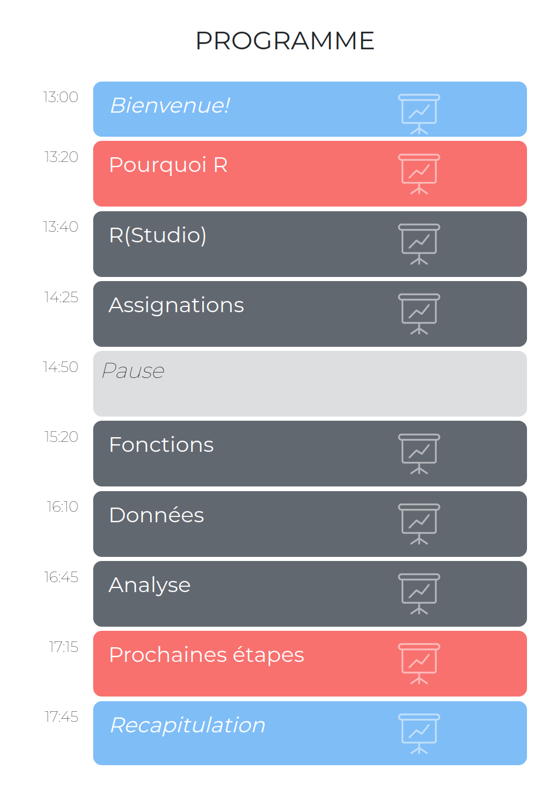
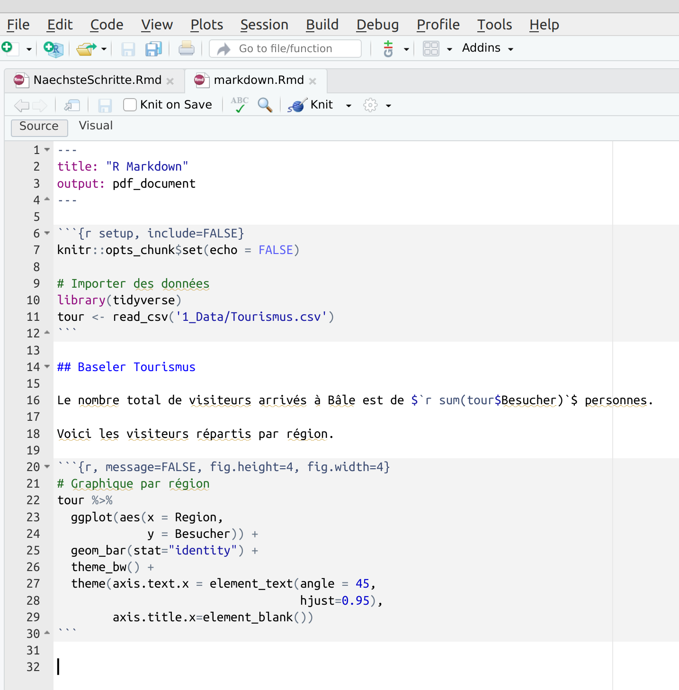
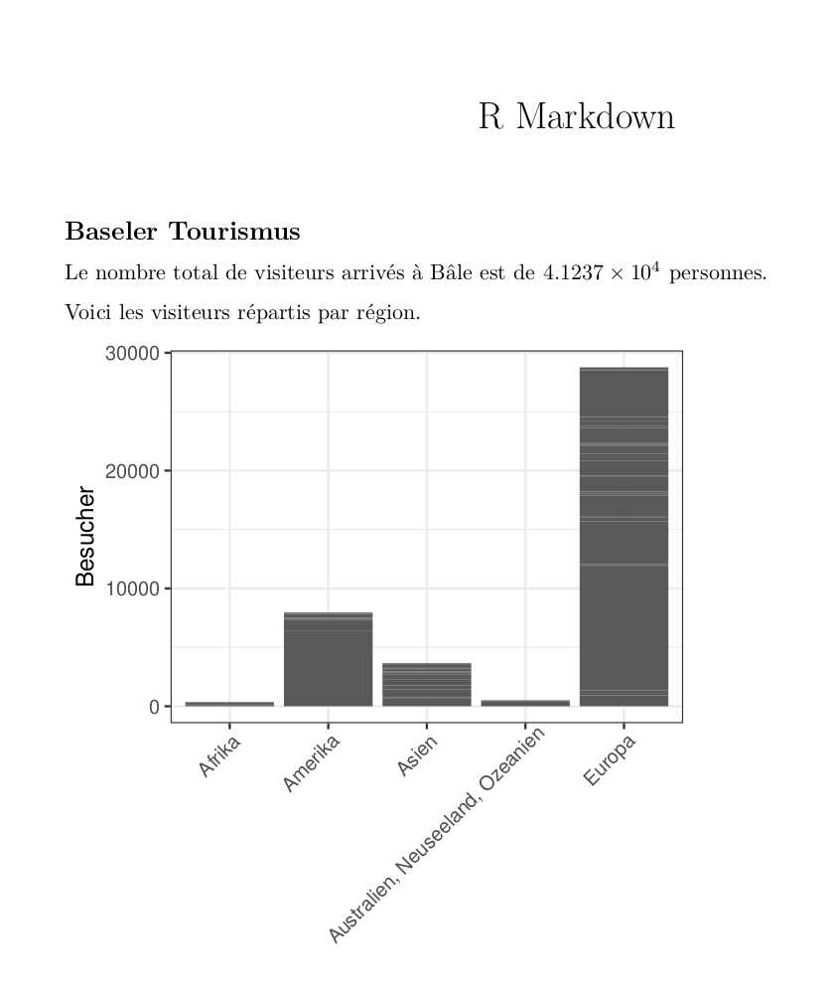

layout: true

<div class="my-footer">
  <span style="text-align:center">
    <span> 
      
    </span>
    <a href="https://therbootcamp.github.io/">
      <span style="padding-left:82px"> 
        <font color="#7E7E7E">
          www.therbootcamp.com
        </font>
      </span>
    </a>
    <a href="https://therbootcamp.github.io/">
      <font color="#7E7E7E">
      Introduction à l'analyse de données avec R | Juin 2023
      </font>
    </a>
    </span>
  </div> 

---

```{r setup, include=FALSE}
# see: https://github.com/yihui/xaringan
# install.packages("xaringan")
# see: 
# https://github.com/yihui/xaringan/wiki
# https://github.com/gnab/remark/wiki/Markdown
options(width=110)
options(digits = 4)
```


.pull-left45[

<br><br><br><br><br>

# Félicitations

Vous comprenez maintenant les bases de R!

]

.pull-right4[


]

---

# R peut faire beaucoup plus

.pull-left5[

<font size = 6>

- `{tidyverse}` <br>
- `{tidyverse}` "élargi"<br>
- Web scrapping<br>
- Analyse de texte<br>
- Statistique<br>
- Machine Learning<br>
- Reporting<br>
- Sites Web<br>

</font>


]


.pull-right5[
<p align="center"></p>
]


---

# `tidyverse`

Das [`tidyverse`](https://www.tidyverse.org/) est essentiellement une collection de libraries performantes et conviviales qui ont été spécialement développés pour une analyse de données plus efficace.
1. `ggplot2` pour les graphique.
2. `dplyr` pour la transformation de données.
3. `tidyr` pour le nettoyage de données.
4. `readr` pour chargement et enrégistrement de données.
5. `purrr` pour la programmation fonctionnelle.
6. `tibble` les `data.frame`s modernes.
<br><br>

```{r, out.height = "200px", echo = F}
knitr::include_graphics("http://d33wubrfki0l68.cloudfront.net/0ab849ed51b0b866ef6895c253d3899f4926d397/dbf0f/images/hex-ggplot2.png")
knitr::include_graphics("http://d33wubrfki0l68.cloudfront.net/071952491ec4a6a532a3f70ecfa2507af4d341f9/c167c/images/hex-dplyr.png")
knitr::include_graphics("http://d33wubrfki0l68.cloudfront.net/5f8c22ec53a1ac61684f3e8d59c623d09227d6b9/b15de/images/hex-tidyr.png")
knitr::include_graphics("http://d33wubrfki0l68.cloudfront.net/66d3133b4a19949d0b9ddb95fc48da074b69fb07/7dfb6/images/hex-readr.png")
knitr::include_graphics("http://d33wubrfki0l68.cloudfront.net/9221ddead578362bd17bafae5b85935334984429/37a68/images/hex-purrr.png")
knitr::include_graphics("http://d33wubrfki0l68.cloudfront.net/f55c43407ae8944b985e2547fe868e5e2b3f9621/720bb/images/hex-tibble.png")
```

---

# `ggplot2`

.pull-left45[

```{r eval = F, message=F}
library(tidyverse) ; library(ggrepel)

# Chargement des données
tour <- read_csv('1_Data/Tourismus.csv') 

# Créer un graphique avec ggplot2
ggplot(data = tour,
       mapping = aes(x = Besucher, 
                     y = Dauer,
                     label = Land)) +
  scale_x_continuous(trans = 'log2') + 
  geom_point(size=2) 

```

]

.pull-right45[

```{r, echo = F, message=FALSE, warning=F,dpi=300,fig.height=5,fig.width=5.5}
library(tidyverse) ; library(ggrepel)

# Chargement des données
tour <- read_csv('1_Data/Tourismus.csv') 

# Graphique de Dauer par rapport à Besucher
ggplot(data = tour,
       mapping = aes(x = Besucher, 
                     y = Dauer,
                     label = Land)) +
  scale_x_continuous(trans = 'log2') + 
  geom_point(size=2) 
```

]


---

# `ggplot2`

.pull-left45[

```{r eval = F, message=F, warning=F}
library(tidyverse) ; library(ggrepel)

# Chargement des données
tour <- read_csv('1_Data/Tourismus.csv') 

# Graphique de Dauer par rapport à Besucher
ggplot(data = tour,
       mapping = aes(x = Besucher, 
                     y = Dauer,
                     label = Land)) +
  scale_x_continuous(trans = 'log2') + 
  geom_point(size=2) + 
  geom_label_repel(size = 2,
                   label.padding = 0.1) +
  theme_bw() 

```

]

.pull-right45[

```{r, echo = F, message=FALSE, warning=F,dpi=300,fig.height=5,fig.width=5.5}
library(tidyverse) ; library(ggrepel)

# Chargement des données
tour <- read_csv('1_Data/Tourismus.csv') 

# Graphique de Dauer par rapport à Besucher
ggplot(data = tour,
       mapping = aes(x = Besucher, 
                     y = Dauer,
                     label = Land)) +
  scale_x_continuous(trans = 'log2') + 
  geom_point(size=2) + 
  geom_label_repel(size = 3,
                   label.padding = 0.1) +
  theme_bw() 
```

]


---

# `ggplot2`

.pull-left45[

```{r eval = F, message=F, warning=F}
library(tidyverse) ; library(ggrepel)

# Chargement des données
tour <- read_csv('1_Data/Tourismus.csv') 

# Graphique de Dauer par rapport à Besucher
ggplot(data = tour,
       mapping = aes(x = Besucher, 
                     y = Dauer,
                     label = Land)) +
  scale_x_continuous(trans = 'log2') + 
  geom_point(size=2) + 
  geom_label_repel(size = 2,
                   label.padding = 0.1) +
  theme_bw() +
  facet_grid(Region ~ .)


```

]

.pull-right45[

```{r, echo = F, message=FALSE, warning=F,dpi=300,fig.height=5,fig.width=5.5}
library(tidyverse) ; library(ggrepel)

# Chargement des données
tour <- read_csv('1_Data/Tourismus.csv') 

# Graphique de Dauer par rapport à Besucher
ggplot(data = tour,
       mapping = aes(x = Besucher, 
                     y = Dauer,
                     label = Land)) +
  scale_x_continuous(trans = 'log2') + 
  geom_point(size=2) + 
  geom_label_repel(size = 2,
                   label.padding = 0.1) +
  theme_bw() +
  facet_grid(Region ~ .)
```

]

---

# `dplyr`

.pull-left45[

```{r eval = F, message=F, warning=F}
library(tidyverse) 

# Chargement des données
tour <- read_csv('1_Data/Tourismus.csv') 

# Affichage du Top 10 de Nachte par Land
tour %>%
  mutate(Nachte = Besucher * Dauer) %>%
  arrange(desc(Nachte)) %>%
  select(Land,  Nachte) %>%
  top_n(10)


```

]

.pull-right45[

```{r, echo = F, message=FALSE,dpi=300,fig.height=5,fig.width=5.5}
# Chargement des données
tour <- read_csv('1_Data/Tourismus.csv') 
tour$Region[tour$Region == 'Australien, Neuseeland, Ozeanien'] = 'Australien'

# Affichage du Top 10 de Nachte par Land
tour %>%
  mutate(Nachte = Besucher * Dauer) %>%
  arrange(desc(Nachte)) %>%
  select(Land,  Nachte) %>%
  top_n(10)

```

]

---

# `dplyr`

.pull-left45[

```{r eval = F, message=F}
library(tidyverse) 

# Chargement des données
tour <- read_csv('1_Data/Tourismus.csv') 

# Statistiques de Nachte par Region
tour %>%
  mutate(Nachte = Besucher * Dauer) %>%
  group_by(Region) %>%
  summarize(
    Nachte_mittel = mean(Nachte),
    Nachte_summe = sum(Nachte),    
  )

```

]

.pull-right45[

```{r, echo = F, message=FALSE,dpi=300,fig.height=5,fig.width=5.5}
# Chargement des données
tour <- read_csv('1_Data/Tourismus.csv') 
tour$Region[tour$Region == 'Australien, Neuseeland, Ozeanien'] = 'Australien'

# Statistiques de Nachte par Region
tour %>%
  mutate(Nachte = Besucher * Dauer) %>%
  group_by(Region) %>%
  summarize(
    Nachte_mittel = mean(Nachte),
    Nachte_summe = sum(Nachte),    
  )

```

]

---

# `dplyr` + `gplot2`

.pull-left45[

```{r eval = F, message=F}
library(tidyverse) ; library(ggrepel)

# Chargement des données
tour <- read_csv("1_Data/Tourismus.csv") 
europa <- read_csv("1_Data/Europa.csv") 

# Verbinde Nachte mit Aquivalenzeinkommen
tour %>%
  mutate(Nachte = Besucher * Dauer) %>%
  left_join(europa) %>%
  ggplot(aes(x = Aquivalenzeinkommen, 
             y = Nachte,
             label = Land)) +
  scale_y_continuous(trans = 'log2') + 
  geom_point() +
  geom_label_repel(size = 2) +
  theme_bw() 

```

]

.pull-right45[

```{r echo=FALSE, fig.height=5, fig.width=5.5, message=FALSE, warning=FALSE, dpi=300}
library(tidyverse) ; library(ggrepel)

# Chargement des données
tour <- read_csv("1_Data/Tourismus.csv") 
europa <- read_csv("1_Data/Europa.csv") 

# Affichage du Top 10 de Nachte par Region
tour %>%
  mutate(Nachte = Besucher * Dauer) %>%
  left_join(europa) %>%
  ggplot(aes(x = Aquivalenzeinkommen,
             y = Nachte,
             label = Land)) +
  scale_y_continuous(trans = 'log2') +
  geom_point() +
  geom_label_repel(size = 2) +
  theme_bw()
```

]


---

# `tidyverse` "élargi"

L'environment de [`tidyverse`](https://www.tidyverse.org/) contient une collection d'autres packages hautes performances et conviviaux qui complètent le noyau Tidyverse. 
1. `xlm2` pour le traitement des fichiers XML et HTML.
2. `rvest` pour le "Web Scraping".
3. `haven` pour le traitement de données de SPSS, SAS et Stata.
4. `readxl` pour le traitement de données Excel.
5. `lubridate` pour les données temporelles.
6. `tidytext` pour les textuelles.
<br><br>

```{r, out.height = "200px", echo = F}
knitr::include_graphics("https://github.com/rstudio/hex-stickers/raw/master/PNG/rvest.png")
knitr::include_graphics("https://github.com/rstudio/hex-stickers/raw/master/PNG/haven.png")
knitr::include_graphics("https://github.com/rstudio/hex-stickers/raw/master/PNG/readxl.png")
knitr::include_graphics("https://github.com/rstudio/hex-stickers/raw/master/PNG/lubridate.png")
#knitr::include_graphics("https://pbs.twimg.com/media/DeacLnGU0AAlmS9.png")
```


---

# Web Scraping

```{r, echo = F, message=F}
options(tibble.print_max = 6, tibble.width=90)
library(xml2) ; library(rvest) ; library(tibble)
```

```{r message=FALSE}
library(tidytext)
# Charger la table de Wikipédia (n'oubliez pas les libraries)
read_html("https://en.wikipedia.org/wiki/R_(programming_language)") %>%
  html_text() %>%
  tibble() %>%
  unnest_tokens(word, ".")
```

---

# Analyse de texte

.pull-left5[

```{r, message=F, eval = FALSE}
library(wordcloud)
library(dplyr) ; library(stringr)

# Comptage de mots
read_html("https://en.wikipedia.org/wiki/R_(programming_language)") %>%
  html_text() %>%
  tibble() %>%
  unnest_tokens(word, ".") %>%
  filter(!str_detect(word, '[:digit:]')) %>%
  anti_join(stop_words) %>%
  count(word, sort = TRUE) %>%
  top_n(100) 
```

]

.pull-right4[

```{r, echo = F, message=FALSE,dpi=300,fig.height=5,fig.width=5.5}
library(wordcloud)
library(dplyr) ; library(stringr)

# Comptage de mots
read_html("https://en.wikipedia.org/wiki/R_(programming_language)") %>%
  html_text() %>%
  tibble() %>%
  unnest_tokens(word, ".") %>%
  filter(!str_detect(word, '[:digit:]')) %>%
  anti_join(stop_words) %>%
  count(word, sort = TRUE) %>%
  top_n(100) 
```

]
---

# Nuage de mots

.pull-left5[

```{r, message=F, warning=F, eval = F}
library(dplyr) ; library(tidytext) ; library(wordcloud) ; library(stringr)

counts <- 
  read_html("https://en.wikipedia.org/wiki/R_(programming_language)") %>%
  html_text() %>%
  tibble() %>%
  unnest_tokens(word, ".") %>%
  filter(!str_detect(word, '[:digit:]')) %>%
  anti_join(stop_words) %>%
  count(word, sort = TRUE) %>%
  top_n(100)

# Nuage de mots
par(mar=c(0,0,0,0))
wordcloud(counts$word, 
          counts$n)
  
```

]

.pull-right4[

```{r, message=F, warning=F, echo=FALSE, fig.width=5,fig.height=5,dpi=300}
library(dplyr) ; library(tidytext) ; library(wordcloud) ; library(stringr)

counts <- 
  read_html("https://en.wikipedia.org/wiki/R_(programming_language)") %>%
  html_text() %>%
  tibble() %>%
  unnest_tokens(word, ".") %>%
  filter(!str_detect(word, '[:digit:]')) %>%
  anti_join(stop_words) %>%
  count(word, sort = TRUE) %>%
  top_n(100)

# Nuage de mots
par(mar=c(0,0,0,0))
wordcloud(counts$word, 
          counts$n)
  
```

]

---

# Statistique


.pull-left45[

```{r, message=F, eval = TRUE}
library(tidyverse)

# Chargement des données
tour <- read_csv('1_Data/Tourismus.csv')
land <- read_csv('1_Data/Lander.csv')                 

# Joindre les données
data <- tour %>% 
  inner_join(land) %>%
  mutate(Nachte = Besucher * Dauer)

# Régression linéare
model <- lm(Nachte ~ Bevolkerung + 
                    Dichte + BIP,
           data = data)
```

]

.pull-right45[


```{r, message=F, warning=F}
# Coéficient de détermination
summary(model)$r.squared
```

```{r, message=F, warning=F}
# Coefficients
summary(model)$coef[,-2]
```
]

---

.pull-left45[

# Machine Learning

```{r, message=F, eval=F}
library(tidyverse) ; library(rpart)

# Chargement des données
tour <- read_csv('1_Data/Tourismus.csv')
land <- read_csv('1_Data/Lander.csv')                 

# Joindres les données
data <- tour %>% 
  inner_join(land) %>%
  mutate(Nachte = Besucher * Dauer)

# Régression linéare
rpart(
  formula = Besucher ~ Bevolkerung + 
                       Dichte + BIP,
  data = data) 
  
```

]

.pull-right45[

<br><br>

```{r echo=F, fig.height=5, fig.width=5, message=FALSE, warning=FALSE, dpi=300}
library(tidyverse) ; library(rpart)
library(rattle)

# Chargement des données
tour <- read_csv('1_Data/Tourismus.csv')
land <- read_csv('1_Data/Lander.csv')                 

# Joindre les données
data <- tour %>% 
  inner_join(land) %>%
  mutate(Nachte = Besucher * Dauer)

# Régression linéare
rpart(
  formula = Besucher ~ Bevolkerung + 
                       Dichte + BIP,
  data = data,
  control = rpart.control(cp = 0)) %>%
  fancyRpartPlot(caption = '')
```

]
---

# Reporting

R et RStudio fournissent également d'excellents outils pour créer <high>Rapports</high>, <high>Slides</high>, et même des <high>sites Web</high>. 
1. `rmarkdown` pour des documents PDF crées de manière dynamique.
2. `xaringan` pour des Slides.
3. `shiny` pour des sites Web et des Cockpits.

<br><br>

```{r, out.height = "200px", echo = F}
knitr::include_graphics("https://github.com/rstudio/hex-stickers/raw/master/PNG/rmarkdown.png")
knitr::include_graphics("https://github.com/rstudio/hex-stickers/raw/master/PNG/xaringan.png")
knitr::include_graphics("https://github.com/rstudio/hex-stickers/raw/master/PNG/shiny.png")
```


---

.pull-left45[

# `rmarkdown`

<p align="left"></p>
]

.pull-right5[
<br><br>
<p align="center"></p>
]

---

# `Web sites`

<iframe width="1000" height="600" src="https://vac-lshtm.shinyapps.io/ncov_tracker/?_ga=2.157815026.975657143.1601587486-2064892133.1598629448" frameborder="0" allowfullscreen></iframe>

---

# Prochaines étapes

.pull-left5[
<font size = 4><i>
<font size = 6>
1. Appliquer<br>
2. Manuels<br>
3. Sources Web<br>
4. Support et Consulting<br>
5. Cours avancés<br>
]

</font>
<br>

.pull-right5[
<p align="center"></p>
]

---

# Manuels

Voici une liste partielle de bons livres sur R plus au moins ordonnés selon l'expérience de l'utilisateur.<br><br>

<table width="80%" style="cellspacing:0; cellpadding:0; border:none;">

  <tr>    

  <td> 
  <a href="http://r4ds.had.co.nz/"></a>
  </td>

  <td>
  <a href="https://covers.oreillystatic.com/images/0636920028574/cat.gif"></a>
  </td>

  <td> 
  <a href="https://ggplot2-book.org/"></a>
  </td>

  <td>
  <a href="https://www.springer.com/de/book/9783540799979"></a>
  </td>
  
  <td>
  <a href="https://bookdown.org/ndphillips/YaRrr/"></a>
  </td>
  
  <td>
  <a href="https://www.orellfuessli.ch/shop/home/artikeldetails/ID35367941.html?ProvID=10917736&gclid=Cj0KCQiAg_HhBRDNARIsAGHLV5238Q26gQmFttHRnYGjcAhz4CslStb-3qBegvuZS5gnCpWSLNlQvF0aAgfOEALw_wcB"></a>
  </td>
  
  </tr>
  

  <tr style="background-color:#ffffff">

  <td>
  <a href="http://appliedpredictivemodeling.com/"></a>
  </td>
  
  <td>
  <a href="http://www-bcf.usc.edu/~gareth/ISL/ISLR%20First%20Printing.pdf"></a>
  </td>
  
  <td>
  <a href="https://www.manning.com/books/deep-learning-with-r"></a>
  </td>


  <td>
  <a href="https://csgillespie.github.io/efficientR/"></a>
  </td>

  <td>
  <a href="www.rcpp.org/"></a>
  </td>
  
  
  <td>
  <a href="http://adv-r.had.co.nz/"></a>
  </td>


  </tr>
  


</table>
<br>


---

.pull-left4[

# Sources Web

Le net est probablement le meilleur endroit pour obtenir des informations sur R.

<font size = 4><i>Naturellement, dans un moteur de recherche:</i></font>

Example dans [Google](https://www.google.com) ou [DuckDuckGo](https://duckduckgo.com) et assurez-vous que *R* ou *Rproject* est mentionné dans votre recherche.

<font size = 4><i>Souvent, vous serez redirigé vers:</i></font>

[R-bloggers](https://www.r-bloggers.com) informations sur les derniers développements R (comprend une newsletter).

[Stackoverflow tag R](https://stackoverflow.com/questions/tagged/r) est une page pour les problèmes R avec des solutions proposés par d'autres utilisateurs. Essayez de publier un problème vous-même. Souvent, vous obtenez des réponses étonnamment rapidement.

]

.pull-right5[
<p align="left" style="padding: 0 0px"><br><br><br><br><br><br><br><br><br>
    <a href="https://www.google.com/"></a><br><br><br2>
    <a href="https://www.r-bloggers.com/"></a><br>
  <a href="https://stackoverflow.com/"></a>
</p>
]

---

# Support et Consulting

<table class="tg"  style="cellspacing:0; cellpadding:0; border:none">
  <col width="22%">
  <col width="22%">
  <col width="22%">
  <col width="22%">
  <tr>
    <th class="tg-yw4l" valign='top'>
    <p align="center"><br>
    <a href="www.dirkwulff.org"></a><br>
    <p align="center">
    <font size = 5>Dr. Dirk Wulff</font><br><br>
    <a href="www.dirkwulff.org"><b>dirkwulff.org</b></a><br>
    <a href="https://github.com/dwulff"><b>github.com/dwulff</b></a><br>
    <font size=4><i>packages: </i></font> 
    <a href="https://cran.r-project.org/web/packages/cstab/index.html"><b>cstab</b></a>, <a href="https://github.com/dwulff/text2sdg"><b>text2sdg</b></a>, <br>
    <a href="https://cran.r-project.org/web/packages/mousetrap/index.html"><b>mousetrap</b></a>, <a href="https://cran.r-project.org/web/packages/memnet/index.html"><b>memnet</b>, <a href="https://github.com/dwulff/choicepp"><b>choicepp</b>
    </p>  
  </th>
  
  <th class="tg-yw4l" valign='top'><p align="center"><br>
    <a href="https://psychologie.unibas.ch/en/persons/markus-steiner/about-me/"></a><br>
    <p align="center">
    <font size = 5>Markus Steiner</font><br><br>
    <a href="https://github.com/mdsteiner"><b>github.com/mdsteiner</b></a><br>
    <font size=4><i>packages: </i></font> 
    <a href="https://github.com/mdsteiner/ShinyPsych"><b>ShinyPsych</b></a>, <br>
    <a href="https://github.com/mdsteiner/EFAdiff"><b>EFAdiff</b></a> <br><br>
    </p>
  </th>
  
  <th class="tg-yw4l" valign='top'>
    <p align="center">
    <p align="center"><br>
    <a href="https://www.schulte-mecklenbeck.com/"></a><br>
    <p align="center">
    <font size = 5>Dr. Michael Schulte-<br>Mecklenbeck</font><br><br>
    <a href="www.schulte-mecklenbeck.com"><b>schulte-mecklenbeck.com</b></a><br>
    <a href="https://github.com/schultem"><b>github.com/schultem</b></a><br><br>
    </p>
  </th>

  <th class="tg-yw4l" valign='top'>
    <p align="center">
    <p align="center"><br>
    <a href="https://www.joao-ramalho.ch/"></a><br>
    <p align="center">
    <font size = 5>João Ramalho</font><br><br>
    <a href="https://www.joao-ramalho.ch/"><b>joao-ramalho.ch</b></a><br>
    <font size=4><i>book/package: </i></font> 
    <a href="https://j-ramalho.github.io/industRial/"><b>industRial</b></a> <br>
    </p>
  </th>

</tr>

</table>
---


# Cours avancés

(Adaptation pour le français en préparation)


<table class="tg"  style="cellspacing:0; cellpadding:0; border:none;">
<tr valign="top">
  <col width="20%">
  <col width="20%">
  <col width="20%">
  <col width="20%">
  <col width="20%">
  <td>
    <p align="center">
      <a class="project-link" href="https://therbootcamp.github.io/#courses" align="center">
      <font style="font-size:20px;weight:700"><br>Einführung in die moderne Datenanalyse mit R</font><br>
      <br>
      </img><br><br>
      <high><br></high><br><br><br><br>
    </p>
  </td>
  <td>
    <p align="center">
      <a class="project-link" href="https://therbootcamp.github.io/#courses" align="center">
      <font style="font-size:20px;weight:700"><br>Explorative Datenanalyse mit R<br></font><br>
      <br>
      </img><br><br>
      <high><br></high><br><br><br><br>
    </p>
  </td>
  <td>
    <p align="center">
      <a class="project-link" href="https://therbootcamp.github.io/#courses" align="center">
      <font style="font-size:20px;weight:700"><br>Statistik mit R<br><br></font><br>
      <br>
      </img><br><br>
      <high><br></high><br><br><br><br>
      </a>
    </p>
  </td>
  <td>
    <p align="center">
      <a class="project-link" href="https://therbootcamp.github.io/#courses" align="center">
      <font style="font-size:20px;weight:700"><br>Maschinelles Lernen mit R<br></font><br>
      <br>
      </img><br><br>
      <high><br></high><br><br><br><br>
      </a>
    </p>
  </td>
  <td>
    <p align="center">
      <a class="project-link" href="https://therbootcamp.github.io/#courses" align="center">
      <font style="font-size:20px;weight:700"><br>Reporting mit R<br><br></font><br>
      <br>
      </img><br><br>
      <high><br></high><br><br><br><br>
      </a>
    </p>
  </td>
  </tr>


---

.pull-left45[
# Merci de votre feedback
<br><br>

<p align = "center">
  </img><br>
  <font style="font-size:10px">from <a href="https://cdn-images-1.medium.com/max/1600/1*5OZNYAfzDZfM1lwJBZEuHQ.png">medium.com</a></font>
</p>

]

.pull-right45[

<p align="center"><br><br>

]

  
---

class: center, middle

# Merci!

